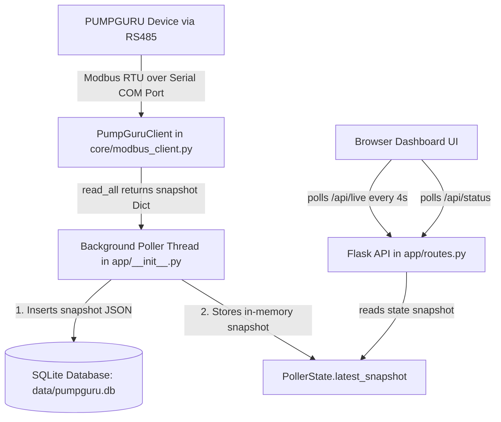

# PUMPGURU Web Application — Developer & Integration Guide

Welcome to the **PUMPGURU Web Application** developer guide. This document explains the architecture, file structure, data flow, database storage, Modbus polling mechanism, and contains a step-by-step guide on how to add new registers or fault codes and render them on the web dashboard.

---

## 1. Project Directory Structure

Here is a high-level overview of the folders and files in the repository:

```text
pumpguru_web/
├── config/
│   └── register_map.py         # <-- Central register addresses, scale factors, and connection configurations
├── core/
│   ├── modbus_client.py        # <-- Handles Modbus communication over RS485 and register decoding
│   ├── data_logger.py          # <-- SQLite data logging logic (inserts snapshots and tracks fault transitions)
│   └── poller.py               # <-- CLI entry point for a dedicated polling process (running without web app)
├── app/
│   ├── __init__.py             # <-- Flask application factory & background poller thread coordinator
│   ├── routes.py               # <-- Flask blueprints (REST API endpoints and page routes)
│   ├── templates/
│   │   ├── base.html           # <-- Layout shell, sidebar connection badge, and scripts loading
│   │   ├── dashboard.html      # <-- Real-time measurement tiles, Trend charts, and protection status panel
│   │   ├── reports.html        # <-- UI for generating and downloading Excel reports
│   │   └── settings.html       # <-- UI for changing Slave ID and viewing configured registers
│   └── static/
│       ├── css/
│       │   └── style.css       # <-- Page layouts, custom CSS grid, and fault alert animations
│       └── js/
│           └── common.js       # <-- Shared Javascript (connection status badge polling, formatting utilities)
├── data/
│   └── pumpguru.db             # <-- SQLite Database storing all logged snapshots and historical fault events
├── reports/
│   ├── report_generator.py     # <-- Generates Excel reports containing summary statistics and trends
│   └── output/                 # <-- Exported Excel report downloads (.xlsx)
├── requirements.txt            # <-- Dependencies list (Flask, openpyxl, pymodbus, pyserial, etc.)
├── run.py                      # <-- Web Application launcher (Main Entry Point)
└── DEVELOPER_GUIDE.md          # <-- This documentation file
```

---

## 2. Data Flow Architecture

The data flows from the physical PUMPGURU hardware device all the way to the user's web browser in a series of steps:



1. **Modbus Polling Thread:** When you run `python run.py`, Flask starts a background worker thread (`_poll_loop` in [`app/__init__.py`](file:///c:/Users/Karthik/Desktop/PUMPAPP/Pump%20modbus/pumpguru_web/app/__init__.py)) that loops indefinitely on the configured interval (default: every 5 seconds).
2. **Modbus Reading:** The thread uses `PumpGuruClient` to connect to the serial COM port (e.g. `COM9`) and issues Modbus RTU requests to read holding registers:
   * It reads measurement registers (currents, voltages) in blocks or one-by-one.
   * It reads the single fault status register (address `3041`).
3. **In-Memory Cache & Logging:**
   * The parsed numbers and active faults are saved as a python dictionary (snapshot).
   * The poller thread updates the global `PollerState` object in RAM.
   * Simultaneously, it sends this snapshot to the `DataLogger` which writes it to the SQLite database (`pumpguru.db`).
4. **Flask Web API:** The web browser does not talk directly to the Modbus hardware. Instead, the page templates ([`dashboard.html`](file:///c:/Users/Karthik/Desktop/PUMPAPP/Pump%20modbus/pumpguru_web/app/templates/dashboard.html)) request the URL `/api/live` every 4 seconds. Flask instantly responds with the latest in-memory cache snapshot.

---

## 3. Modbus Communication Details

The project utilizes **Modbus RTU (Remote Terminal Unit)** over a serial interface (typically a USB-to-RS485 adapter connected to the computer's COM port).

### Modbus Client (`PumpGuruClient`)
* **Libraries:** Uses `pymodbus` to handle the frame structuring, CRC check calculation, and serial port communication, and uses `pyserial` under the hood to manage COM port settings.
* **Auto-Detection:** If the serial port is set to `"AUTO"` in `SERIAL_CONFIG`, the client scans the operating system's active COM ports. It identifies common USB-to-serial chips (such as CH340, FTDI, Prolific, Silicon Labs) and issues a quick test read. The first port that responds to a Modbus query is chosen.
* **Function Codes:** Measurements and faults are read using **Function Code 0x03 (Read Holding Registers)**.
* **Scale Factors:** Modbus registers are standard 16-bit integer values (0–65535). Decimal figures (like `5.72 A` of current) cannot be stored directly. The device scales the values up by multiplying them (e.g., `5.72` is sent as integer `57`). The driver divides these integers by scale factors to get the correct floating-point values:
  * **Voltage Scale (1)**: The device sends raw volts directly (e.g., `445` raw = `445 V`).
  * **Current Scale (10)**: The device sends raw amps multiplied by 10 (e.g., `52` raw = `5.2 A`).

---

## 4. Storage Mechanism & Capacity

Snapshots and fault histories are stored locally inside **[`data/pumpguru.db`](file:///c:/Users/Karthik/Desktop/PUMPAPP/Pump%20modbus/pumpguru_web/data/pumpguru.db)**, which is an SQLite database. It initializes automatically with two main tables:

### Table: `snapshots`
Stores the complete state (measurements, faults, setpoints) of the pump at every single poll interval.
```sql
CREATE TABLE snapshots (
    id INTEGER PRIMARY KEY AUTOINCREMENT,
    timestamp TEXT NOT NULL,         -- ISO-8601 string: YYYY-MM-DDTHH:MM:SS
    measurements_json TEXT,         -- JSON string of measurements: {current_r: 5.2, ...}
    faults_json TEXT,               -- JSON string of boolean statuses: {dry_run: false, ...}
    setpoints_json TEXT             -- JSON string of setpoint configuration limits
);
```

### Table: `fault_events`
Stores a log of when faults change state (when a fault goes **ACTIVE** or gets **CLEARED**). This feeds the event logging and report timeline.
```sql
CREATE TABLE fault_events (
    id INTEGER PRIMARY KEY AUTOINCREMENT,
    timestamp TEXT NOT NULL,
    fault_name TEXT NOT NULL,
    state TEXT NOT NULL             -- 'ACTIVE' or 'CLEARED'
);
```

### Capacity Estimation
SQLite is highly efficient. A single snapshot row uses approximately **150 to 200 bytes** of disk space.
* If polling occurs every **5 seconds**:
  * 1 minute = 12 polls
  * 1 hour = 720 polls (~140 KB)
  * 1 day = 17,280 polls (~3.3 MB)
  * 1 month = ~500,000 polls (~100 MB)
* SQLite databases perform flawlessly up to **several gigabytes**, meaning you can easily store **several years of continuous data** on your local machine without needing maintenance.

---

## 5. Adding New Fields to the Web App (Step-by-Step Flow)

If you want to add a new parameter (e.g., *Power Factor*, *Frequency*, *Energy*, or a new setpoint or fault register), follow this step-by-step sequence.

We will use an example of adding **Frequency** as a new measurement register.

### Step 5.1: Declare the Address in `config/register_map.py`
Open **[`config/register_map.py`](file:///c:/Users/Karthik/Desktop/PUMPAPP/Pump%20modbus/pumpguru_web/config/register_map.py)**. 
Add the configuration to `MEASUREMENT_REGISTERS` with the correct address, scale factor, data type, unit, and label.

```python
# Add this inside MEASUREMENT_REGISTERS in register_map.py:
MEASUREMENT_REGISTERS = {
    ...
    "frequency": {
        "address": 3036,            # The Modbus address
        "reg_type": "holding",      # "holding" or "input"
        "data_type": "uint16",      # "uint16", "int16", "uint32", or "float32"
        "scale": 10,                # If raw 500 = 50.0 Hz, use scale = 10
        "unit": "Hz",               # The physical measurement unit
        "label": "Grid Frequency"   # Human-readable label shown in the UI
    }
}
```

### Step 5.2: Expose on the Frontend (No Backend Code Changes Needed!)
The backend APIs are **fully data-driven**. The endpoints `/api/config` and `/api/live` inspect `MEASUREMENT_REGISTERS` dynamically.
Therefore, adding the entry in `register_map.py` automatically:
1. Causes the `modbus_client` to read this register address.
2. Saves it in SQLite under `measurements_json`.
3. Sends it in the `/api/live` endpoint.
4. Exposes the config meta (unit, label) in `/api/config`.

### Step 5.3: Update the HTML Page to Render the Metric Tile
Open **[`app/templates/dashboard.html`](file:///c:/Users/Karthik/Desktop/PUMPAPP/Pump%20modbus/pumpguru_web/app/templates/dashboard.html)**.

In `dashboard.html`, tiles are built automatically inside `refreshLive()` from the `CONFIG.measurements` dictionary:
```javascript
const tiles = Object.entries(CONFIG.measurements).map(([key, meta]) => ({
  label: meta.label,
  value: fmt(m[key], meta.unit === 'A' ? 2 : (meta.unit === 'V' ? 0 : (meta.unit === 'Hz' ? 1 : 1))),
  unit: meta.unit,
}));
```
*(Notice how we updated our decimal place logic to format `'Hz'` values to 1 decimal place, e.g. `50.0 Hz`)*.

The metrics grid automatically renders an additional tile since it maps over `CONFIG.measurements` directly!

### Step 5.4: Display the Metric in the Trend Charts
If you want to render the new field in the charts, look at the JavaScript chart initialization in `dashboard.html`.

For example, to display a Frequency Trend chart in the dashboard grid:
1. Add a canvas wrapper in the HTML grid of `dashboard.html`:
   ```html
   <div class="panel" id="frequency-panel" style="display:none;">
     <div class="panel-title">Frequency Trend (last 6h)</div>
     <div class="chart-wrap"><canvas id="frequencyChart"></canvas></div>
   </div>
   ```
2. Initialize it in `initCharts()` inside the `<script>` tag:
   ```javascript
   let frequencyChart;
   
   function initCharts(voltageKeys, currentKeys, frequencyKeys) {
     ...
     if (frequencyKeys.length) {
       document.getElementById('frequency-panel').style.display = '';
       const ctxF = document.getElementById('frequencyChart').getContext('2d');
       frequencyChart = new Chart(ctxF, {
         type: 'line',
         data: {
           labels: [],
           datasets: frequencyKeys.map((k, i) => ({
             label: CONFIG.measurements[k].label,
             data: [],
             borderColor: '#f0ad4e',
             tension: 0.3,
             pointRadius: 0
           }))
         },
         options: common
       });
     }
   }
   ```
3. Update the update helper function `keysByUnit('Hz')` and reload it inside `refreshHistory()` to update data points:
   ```javascript
   if (frequencyChart) {
     frequencyChart.data.labels = labels;
     keysByUnit('Hz').forEach((k, i) => { frequencyChart.data.datasets[i].data = data[k] || []; });
     frequencyChart.update('none');
   }
   ```

---

## 6. How Fault Processing Works (Address 3041)

We configured register **`3041`** to read the active fault code. The logic is isolated in `core/modbus_client.py`:

1. **Reading code:**
   ```python
   raw = self._read_raw(3041, "holding", count=1)
   code = raw[0] # Returns 0 to 7
   ```
2. **Deconstruction to Booleans:**
   The client loops over `FAULT_CODE_MAP` (defined in `register_map.py`) and sets the corresponding key to `True` if it matches `code`. All other keys are populated as `False`:
   ```python
   # Resulting output dictionary format:
   {
       "dry_run": True,         # Active if code == 1
       "overload": False,       # False since code != 2
       "stall_pump": False,
       "phase_reverse": False,
       "undervoltage": False,
       "phase_loss": False,
       "overvoltage": False
   }
   ```
3. **HTML Rendering:**
   In `dashboard.html`, `renderFaults()` takes this boolean dictionary.
   * If all values are `False`, it displays the green **"All protection checks OK"** banner.
   * If any value is `True`, it renders the red **"FAULT ACTIVE — [Fault Name]"** alert and plays the pulsing CSS animation on that specific tile.
   * If all values are `None` (comms timeout or OS serial error), it renders the amber **"Comms lost"** banner and tags the tiles as **UNKNOWN**.
